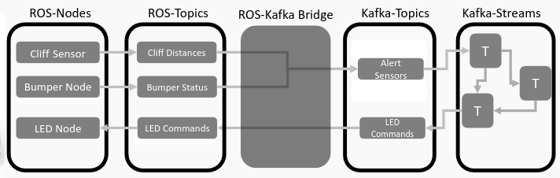
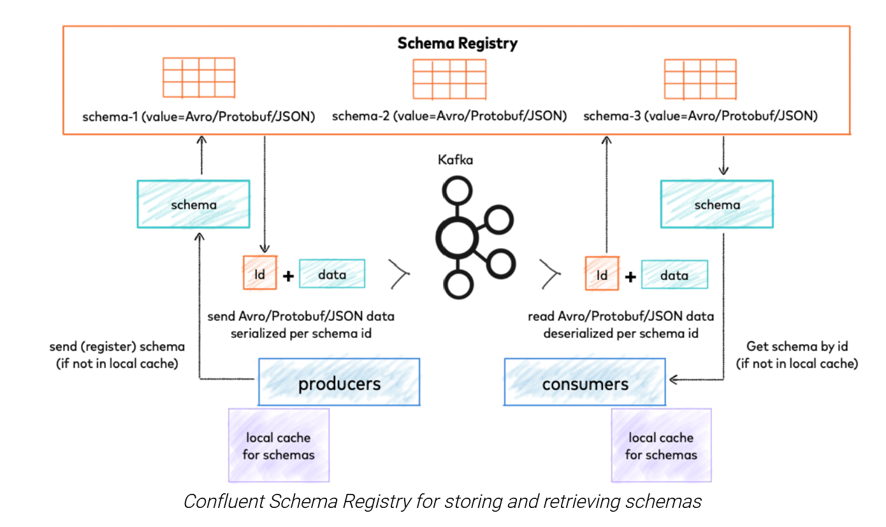
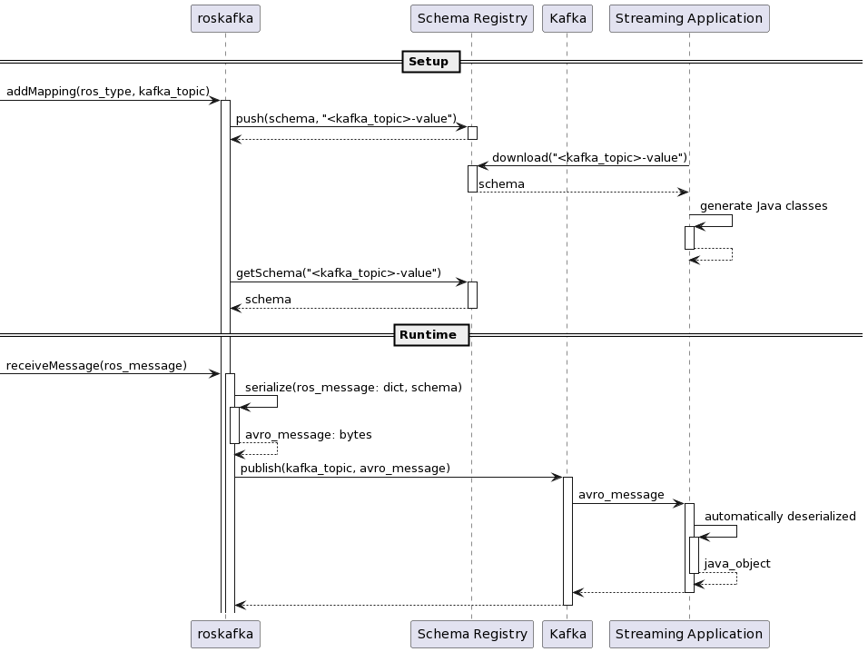
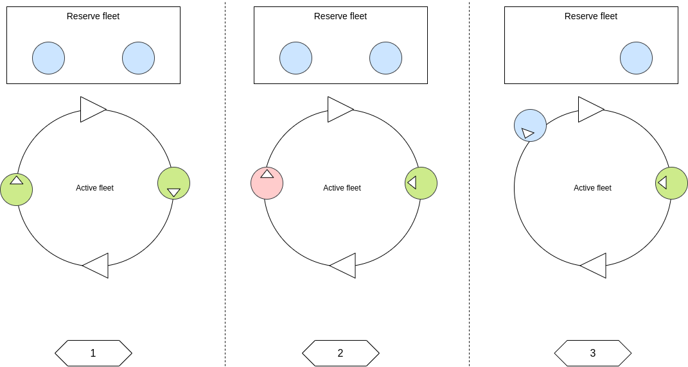
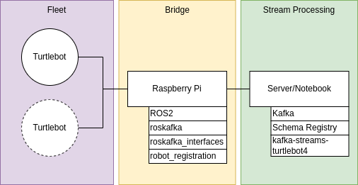
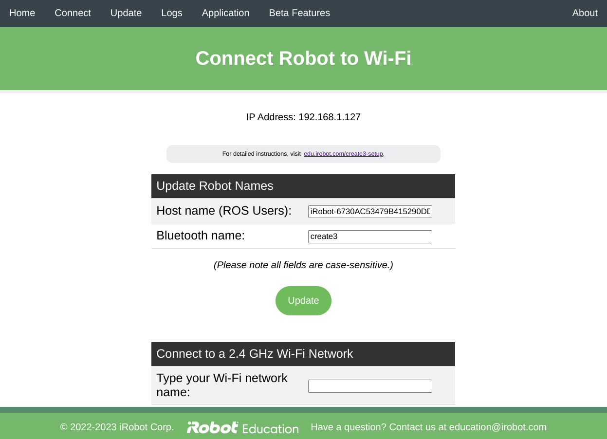
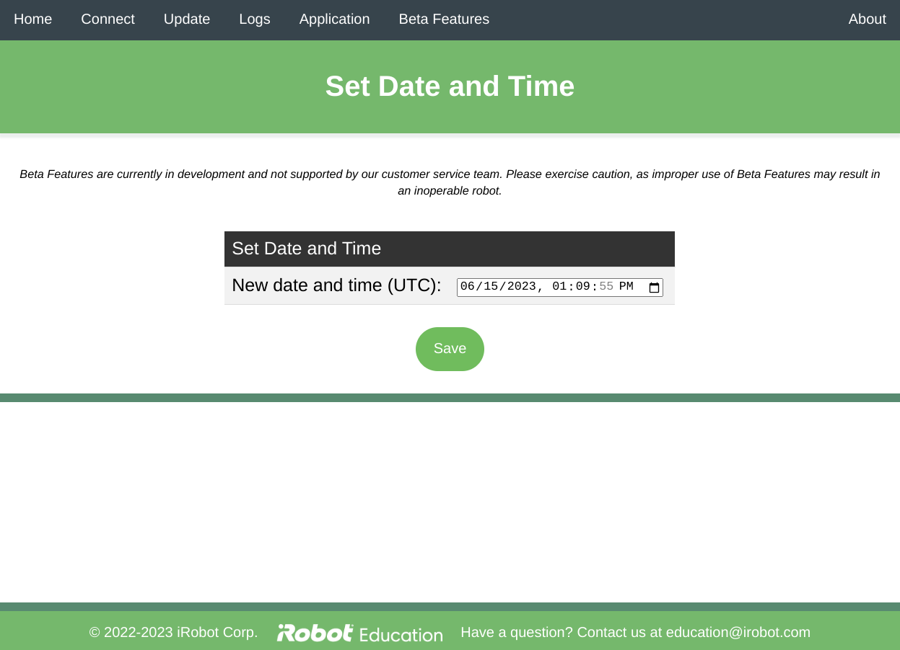

# Stream Processing for ROS-based Application Development

Alexander Grüneberg, Alexander Mattes, Lukas Mendel, Julian Sobott

This document serves as a supplement to our paper, providing additional documentation and details. The structure of this supplemental documentation is as follows:

Architecture and Components: We provide a brief introduction to the architecture and components of the platform. This section outlines the key elements and their functionalities.

Scenarios and Use Cases: We describe the use cases that were employed to validate the platform, including their setup and execution. These use cases demonstrate the practical application of the platform in real-world scenarios.

Implementation and Design Decisions: We delve into the design decisions that were made during the development of the platform. This section explores the rationale behind the choices made and the considerations taken into account.

Additionally, there is an appendix that provides standalone tips and guidelines on utilizing individual components such as the TurtleBots, Apache Kafka, and ROS. These tips offer practical insights into the usage of these components outside of the specific use cases presented in the documentation.


## Introduction

Robot Operating System (ROS) is a middleware platform for the networking of technical components, which is used in particular in robotics and in the automotive sector.

Components such as sensors generate continuous data streams, which reflect the current state of the system or the environment. This information can be published via ROS and consumed by other ROS components in order to be able to perform a timely evaluation of the data streams.

Methods and technologies of stream processing (e.g. based on Kafka Streams or Apache Beam) or Complex Event Processing (CEP) are optimized to receive continuous streams of data, analyze them and perform actions. This is typically done by applying transformations (e.g., filtering, aggregating, grouping and windowing) to summarize fine-grained data in a way that phenomena of interest from a business point of view are made explicit. Corresponding programming models are well documented and have proven themselves in practice for processing large amounts of data.

In the context of this project, we investigate to what extent insights and solutions of stream processing can simplify the development of ROS-based applications. We work out the functional scope of ROS and clarify how an interface to stream processing can be defined. We analyze selected ROS applications and extract strategies where the actual data processing takes place. In the scientific literature, some approaches of a possible integration can be found. However, these refer to a technical integration and only address the objective of this project in a rudimentary way. 


## Architecture and Components

### Architecture Overview

We have developed a platform to bridge between ROS 2 and streaming systems. Kafka was chosen as a broker due to its widespread support in streaming systems. For our use cases, we chose Kafka Streams as a streaming system.

The architecture of this project is split into multiple components and is depicted in the picture below.



The central part of this project is the ROS–Kafka bride, which is responsible for forwarding messages between ROS and Kafka.

On the left side is ROS, where ROS nodes publish events and subscribe to ROS topics. These nodes include the registration node, which registers robots to the ROS–Kafka bridge and other nodes, and the “repetition nodes”, which simply redeliver the last message they receive for every robot in regular intervals.

On the right side is Kafka, where Kafka Streams applications can publish and subscribe to Kafka topics. This side is also responsible for processing sensor data produced by the robots, interpreting it and deciding what actions they should take.


### Platform Advantages

* **Sensor Fusion**: Sometimes a number of sensors collect (somewhat) redundant data, and sometimes sensors may send faulty data. It is possible to evaluate the data points recorded by one sensor with the values collected by other sensors or the robot's global state. Aggregations such as windowing make this fairly easy.
* **Rapid Development**: Creating many ROS nodes that communicate with one another is fairly hard. Defining aggregations in a stream processing system is fairly quick and easy.
* **Cooperative Robots**: ROS 2 is not well suited for robot communication across networks, and our platform improves this issue. Additionally, there are some use cases where data from all robots working together needs to be aggregated and processed. Doing this on the robots themselves is not advisable, since it doesn't scale well. By performing these aggregations on a powerful server, we make sure that the robots aren't overwhelmed.
* **Decoupled Development**: Our platform completely decouples the development of the “what should robots do” and the “how do we control them and collect events” parts. The question “what” is answered by the stream processing system, while the question of “how” is solved via simplified ROS 2 development.
* **Implementing Use Cases**: Stream processing systems are well suited to implement complex use cases and sequences of actions.


### Technologies / Components

#### ROS 2

Robot Operating System is a set of libraries and tools used in an academic environment for the creation of software for robots. In this project, it is used to develop the nodes that publish commands to the robots themselves.


#### Message Broker: Apache Kafka

The goal of the project is to process events on a separate layer, independent of ROS. In order not to limit ourselves early on in the project and the choice of technologies and their capabilities, we decided to use a message broker both for the interface between event processing and ROS and between the individual services for the business logic on the streaming layer.

Various message brokers exist, e.g., Apache Kafka, RabbitMQ, and NATS. In this project, we decided to use Kafka. Kafka has a good ecosystem and supports easy connections to streaming systems like Esper or Apache Beam. Moreover, Kafka supports features like scalability, resilience and replication, which makes it suitable for large industrial applications.


#### Complex Event Processing: Apache Kafka Streams

The business logic of the application is implemented in a stream processing tool. In this project, the use case is the processing of sensor data to detect deviations from the actual state of the robots and to send actions to them if necessary. For this purpose there are different tools like Kafka Streams, Apache Beam or Esper.

We have chosen Kafka Streams because the desired logic can be implemented with little effort compared to other tools, e.g., an extra platform does not have to be set up as it would be necessary with Apache Beam. In addition, there is a low-level (Processor API) and a high-level (DSL API) API. The high-level API allows implementing logic very fast and the low-level API can be used to implement more complex logic, which is not always possible with the high-level API. Furthermore, the integration to Kafka is easy, since Kafka and Kafka Streams are developed by the same company.


#### Bridge: roskafka

roskafka is a ROS 2 package that bridges between ROS 2 and Apache Kafka. The mechanism is flexible and supports use cases such as stream processing.

The package contains two ROS 2 nodes: /ros_kafka and /kafka_ros. /ros_kafka subscribes to a ROS 2 topic and publishes the messages in JSON format to a Kafka topic. /kafka_ros does the opposite.


##### Mappings

The nodes are configured using mappings. Each mapping has a name, a source topic, a destination topic, a type, and additional metadata (key-value pairs).

In response to a mapping,

* /ros_kafka subscribes to the ROS topic named in the _ros_topic_ field of the mapping and publishes to the Kafka topic named in the _kafka_topic_ field of the mapping, and
* /kafka_ros subscribes to the Kafka topic named in the _kafka_topic_ field of the mapping and publishes to a ROS topic named in the _ros_topic_ field of the mapping.

These mappings are dynamic, i.e., they can be added and removed at any time the nodes are running.


##### Message Format

The message formats in ROS and Kafka are similar. Both have a type and a body. In Kafka, the value is split into a key and a value. In addition, each Kafka message has a timestamp and optional headers. In ROS, the body is a collection of fields and constants. In Kafka, serializers and deserializers have to be specified for both key and value: Avro, JSON, and Protobuf are commonly used. In our project, Avro is used. This has the advantages, that every message as a predefined schema and serialization can be done efficiently.

Avro can be used in two ways. In roskafka we use the generic approach. In this approach, a dictionary which contains the data from the ROS message, is passed alongside the schema, to a function. This function serializes the data to Avro. The dictionary structure must match the schema, otherwise an error is thrown. The generic approach offers the advantage to get a well-defined interface with relatively little effort. In Kafka Streams, however, we want specific and not generic objects. Therefore, with the help of a plugin, classes are generated for each Avro schema. These classes can be used in Java like data classes with setters and getters, but internally also handle serialization and deserialization.

To have a common place to store these schemas, a schema registry is used. This way, roskafka and the Kafka Streams application can always have the same schemas and changes need to be done in only one place. Each schema is assigned a globally unique ID. This ID is sent together with the serialized message. If a consumer now receives a message, it can get the corresponding schema from the schema registry with the help of the ID and deserialize the message. The name of the schema is derived from the topic name, but [alternative strategies can be employed](https://docs.confluent.io/platform/current/schema-registry/fundamentals/serdes-develop/index.html#sr-schemas-subject-name-strategy). The following figure shows the functionality of the Schema Registry just described.



The following figure shows the process from creating new messages during setup up to using these messages at runtime in our system.

Setup:

First, a mapping between a ROS type and a Kafka topic is defined. Then a schema is automatically created for the ROS message and sent to the schema registry. These schemas can now be downloaded and the corresponding classes for stream processing can be generated. With these classes generated, the implementation of the business logic in the stream processing application can start.

Runtime:

When messages from different ROS topics arrive at the bridge node, they are converted into corresponding Avro messages and sent to Kafka. These messages can be processed by the streaming application. Messages can also be generated in the Kafka Streams application and sent back to ROS.



The key from the messages sent from Kafka to ROS can be used to specify the target node. (see [Matching Templates](#mapping-templates-18)).


#### ROS 2: Registration node

Many applications need to be initialized whenever a new robot is added to the system. The bridge node must start mapping topics, and ROS nodes may need to start subscribing and publishing to their respective topics. To make this process as easy as possible, the “RobotRegistrationNode” (robot_registration_publisher.py in [https://gitlab.informatik.hs-furtwangen.de/ss23-forschungsprojekt-7/robot_registration](https://gitlab.informatik.hs-furtwangen.de/ss23-forschungsprojekt-7/robot_registration)) has been implemented. This node publishes a string containing the name and type of robot that should be registered to the ROS topic “/robotRegistration”. This message has the format “robot_name/robot_type”. robot_name is an identifier for this robot. Whenever wildcards are used in the mapping config file, the robots name replaces the config in all topic names. The robot_type attribute determines which specific mapping from the generic mappings file is used. 

Every ROS node that requires any form of initialization when a new robot is added (probably every ROS node) should be a subscriber subscribing to the topic “/robotRegistration”. The callback method for this subscriber should implement the initialization. The uniqueness of names is not checked. Registering an already registered robot simply reruns the initialization process.

Alternatively, (synchronous) service calls can be used for dealing with initialization. Starting bridges is done via service calls (though this is automatically done during the registration process). The function add_mappings in the script “robot_registration_helpers.py” ([https://gitlab.informatik.hs-furtwangen.de/ss23-forschungsprojekt-7/robot_registration](https://gitlab.informatik.hs-furtwangen.de/ss23-forschungsprojekt-7/robot_registration)) shows how these calls can be made. We generally recommend using the asynchronous topic based approach over the synchronous service call based approach. The synchronous code is unwieldy at best and increases the code complexity unnecessarily. Additionally, the asynchronous approach increases modularity, since the registration node doesn’t need to know which nodes it starts. Nodes can be added or removed without knock on effects.


#### Build Tools: Maven

Kafka Streams is a library for Java, with which build tools such as Maven or Gradle can be used to build the application. In the project, Maven is used, because there is more knowledge about it. Theoretically, however, there is nothing against using Gradle as a build tool. Gradle was used in the demo and for the final project we used Maven.


#### Java Frameworks: Quarkus

To increase development speed and ease in setup, frameworks such as Spring Boot or Quarkus can be used. These frameworks simplify the configuration to connect to Kafka and reduce boilerplate code. The application was first implemented using Spring Boot. This worked, but after each code change, we always had to wait a relatively long time for the application to restart. For this reason, we switched the application to Quarkus. Quarkus allows performing a hot reload, which speeds up local development and testing by a lot.


#### Testing

To simplify testing, it is a good idea to have a way of feeding data into Kafka and reading it again. It is very helpful if this is independent of ROS, so that ROS does not have to be installed on the developer computers.

Python is a good choice for this. With this, Kafka consumers and producers can be written quickly and easily. An advantage of this type of testing is that the interface between ROS and Kafka can be tested, since the ROS nodes in this project are written in Python. The other official supported language of ROS is C++, which would be too costly for testing.

During the tests, it must be considered that the test data can differ from the actual data from ROS. Here it must be ensured with the binding that the formats are the same. For example, the same topic names must be used, and the message schemas must be the same.


#### Summary and Software Versions


<table>
  <tr>
   <td><strong>Technology / Framework</strong>
   </td>
   <td><strong> Version</strong>
   </td>
  </tr>
  <tr>
   <td>ROS 2
   </td>
   <td>Humble
   </td>
  </tr>
  <tr>
   <td>TurtleBot 4 (for the TurtleBots)
   </td>
   <td>1.0.0
   </td>
  </tr>
  <tr>
   <td>Create 3 (for the TurtleBots)
   </td>
   <td>H.1.2
   </td>
  </tr>
  <tr>
   <td>Docker (for Kafka)
   </td>
   <td>24.0.2 +
   </td>
  </tr>
  <tr>
   <td>Docker Compose (for Kafka)
   </td>
   <td>2.18.1 +
   </td>
  </tr>
  <tr>
   <td>Maven (for Kafka Streams application)
   </td>
   <td>3.9.2 +
   </td>
  </tr>
  <tr>
   <td>Quarkus (for Kafka Streams application)
   </td>
   <td>3.1.1
   </td>
  </tr>
  <tr>
   <td>Java  (for Kafka Streams application)
   </td>
   <td>17+
   </td>
  </tr>
  <tr>
   <td>Python
   </td>
   <td>3.11 +
   </td>
  </tr>
  <tr>
   <td>Python Poetry
   </td>
   <td>1.4.1 +
   </td>
  </tr>
</table>


## Scenarios and Use Cases

To show that the platform we developed can aid in the development of ROS 2 applications, we chose a number of small scenarios and use cases and implemented them.

This section simply explains the use cases and why they were developed. How they can be installed and run is explained in later chapters.


### Use Cases

#### The minimal working example: Turtlesim Prototype

This very simple scenario (which can hardly be called a use case) is a simple demonstration that shows a single data roundtrip. It is a tech demo, not a direct abstraction of a real world use case.

Turtlesim is a ROS application that simulates minimalistic robots (visualized as turtles). These turtles publish their position and can receive movement commands.

The user can create a number of turtles and make them move about. The turtlesim prototype simply monitors the position of the present turtles and reacts according to their relative distance. When turtles are “far enough” apart, the background color is green and they move as normal. When they are “somewhat close” the background color becomes yellow. Once they are “very close” the screen becomes red and one of the turtles stops. 

If you first start working on this project, we recommend starting with this use case, since you do not need to use the actual physical robots. Start with finding and listening to the relevant topics (you can print all topics with “ros2 topic list” and show their sent messages with “ros2 topic echo MyTopicName”).


#### The first robot scenario: Hazard Detection

This application demonstrates how the platform can be used to send messages from a number of TurtleBots to a server and how a server can control the TurtleBots. In a nutshell, this application detects when either the bumper (the moving bits at the front of the robot) are continuously pressed for a few seconds, or the robot is lifted off the ground (as detected by the wheels weight sensors). When one of the conditions described above is fulfilled, the LED at the robot's center becomes red. (Though, the turtlesim node also changes the LED color from time to time when the robot is lifted off the ground, so flickering may occur). 

This doesn’t sound too impressive, but can demonstrate a few advantages of the platform quite nicely. Firstly, it demonstrates how robots in one network can communicate with a server located anywhere. Secondly, some aggregations such as windowing are used to make the detection resilient against potentially faulty sensor data. It also demonstrates that it is comparatively easy to use aggregations to implement a small use case.


#### The complete use case

This scenario was the proposed final use case. Because of technical limitations (see [Multiple Robots](#multiple-robots-34)) and limited time, this scenario was not implemented. This scenario would be more complex and demonstrate multiple advantages of stream processing.

The scenario is depicted in the picture below. The idea is that multiple robots work towards a common goal. In this scenario, there are two robot fleets. An active fleet and a reserve fleet. The robots of the reserve fleet are passive, but can be added to the active fleet at any time.

The robots of the active fleet work on a coordinated task. In this case, they travel in a circle at a uniform distance (Stage 1 in the picture). This task is executed until one of the robots is lifted off the ground, i.e., an error condition occurs. This error condition is then to be detected by evaluating various sensors in Kafka Streams.

The robots that are not in a failure state are to turn to the failed robot and take a picture of it (Stage 2 in the picture). Based on this picture, a human can then decide whether the fault is recoverable or whether a robot from the reserve fleet should replace the failed robot.

If a robot is to be replaced, a robot from the reserve fleet takes the place of the failed robot (Stage 3 in the picture). This represents that the new robot tries to fulfill the task of the failed robot. Subsequently, all robots resume their work.

In order to make the program sequence visible to humans, the robots should display their internal state with the help of LEDs.

* Red: Failed
* Green: Working regularly, stage 1
* Green (blinking): Initializing
* Yellow: Warning, stage 2
* Blue: In reserve fleet

The scenario should demonstrate the advantages of how multiple robots can be centrally managed and analyzed.




### Setup

In this chapter, steps are shown how to install each component. This should only be necessary once.


#### ROS 2

[https://gitlab.informatik.hs-furtwangen.de/ss23-forschungsprojekt-7/documentation/-/tree/main/setup](https://gitlab.informatik.hs-furtwangen.de/ss23-forschungsprojekt-7/documentation/-/tree/main/setup) includes a section on how to install ROS.


#### roskafka

The roskafka package and its dependency, roskafka_interfaces, can be installed on either the robot itself, or on an external computer. Putting it on each of the robots has the advantage that, if the topics are not pumped via multicast, network traffic is greatly reduced because data is directly uploaded to Kafka. On the flip side, software has to be installed and configured on each of the robots, which may not even be possible depending on the robot. A separate network node represents an easy-to-manage central instance.

Install pip:

```
sudo apt install python3-pip
```

Install Python dependencies:

```
pip3 install confluent-kafka==2.1.1 fastavro==1.7.4
```

Source ROS 2:

```
source /opt/ros/humble/setup.bash
```

Create and enter workspace:

```
mkdir -p ~/ros2_ws/src
cd ~/ros2_ws/src
```

Download roskafka_interfaces code to ROS 2 workspace:

```
git clone  https://gitlab.informatik.hs-furtwangen.de/ss23-forschungsprojekt-7/roskafka_interfaces.git
```

Download roskafka code to ROS 2 workspace:

```
git clone  https://gitlab.informatik.hs-furtwangen.de/ss23-forschungsprojekt-7/roskafka.git
```

Build packages:

```
cd ~/ros2_ws
PYTHONWARNINGS=ignore:::setuptools.command.install colcon build
```


#### Kafka

Kafka and the schema registry are run inside Docker containers and are started via Docker Compose. The Docker Compose files are in the repositories [kafka-streams-turtlebot4](https://gitlab.informatik.hs-furtwangen.de/ss23-forschungsprojekt-7/kafka-streams-turtlebots4) and [kafka-streams-turtlesim](https://gitlab.informatik.hs-furtwangen.de/ss23-forschungsprojekt-7/kafka-streams).

Before starting, it is necessary to configure the environment. For this, copy the _.env.example_ file to _.env _and adjust the variable _HOST_IP _to the IP under which the host machine can be externally reached. Otherwise, clients will get connection errors. See [Advertised Listener](#advertised-listener-41) in the Appendix for more information. If you’re testing locally and everything that needs to communicate with the Kafka broker is on the same machine, this can be set to _localhost_.

```
cp .env.example .env
vim .env # adjust HOST_IP
```

Start Kafka and the schema registry:

```
docker compose up -d
```


#### Scenario: Turtlesim Prototype

This demo requires a device with a graphical user interface. In this project, a VM with Ubuntu Desktop 22.04 LTS was used.

To install the Turtlesim demo, you will need to install ROS 2, Kafka, and roskafka as described in the steps above. Additionally, the following repositories need to be cloned.

Clone the repository for the robot control components:

```
cd ~/ros2_ws/src
git clone https://gitlab.informatik.hs-furtwangen.de/ss23-forschungsprojekt-7/robot_controll.git
```

Clone the repository containing the robot registration components:

```
cd ~/ros2_ws/src
git clone https://gitlab.informatik.hs-furtwangen.de/ss23-forschungsprojekt-7/robot_registration.git 
```

Clone the repository containing the Kafka Streams Application + some scripts:

```
cd ~
git clone https://gitlab.informatik.hs-furtwangen.de/ss23-forschungsprojekt-7/kafka-streams
```


#### TurtleBots

Setup instructions for the TurtleBots can be found in the [Appendix](#appendix-general-tips-31). You can also follow the official installation instructions ([https://turtlebot.github.io/turtlebot4-user-manual/setup/basic.html](https://turtlebot.github.io/turtlebot4-user-manual/setup/basic.html)).


#### Scenario: Hazard Detection

In the picture below, all necessary components are shown.

The TurtleBot should already be configured from the previous step. We decided to use two additional hardware components, to resemble a possible real world setup as close as possible. A Raspberry Pi is used as a bridge between ROS and Kafka. On the stream processing side, a dedicated server or, for testing, a notebook can be used. On it, Kafka, the schema registry, and the Kafka streams application are running.




##### Bridge: Raspberry Pi

Use a Raspberry Pi with Ubuntu Server 22.04.2 LTS 64-Bit installed.

1. Install ROS 2 according to the official documentation: [https://docs.ros.org/en/humble/Installation/Alternatives/Ubuntu-Development-Setup.html](https://docs.ros.org/en/humble/Installation/Alternatives/Ubuntu-Development-Setup.html)
2. Create a ros2 workspace and clone all necessary repositories. See [Installation roskafka](#roskafka-13) above.


##### Stream Processing: Server/Notebook

For this, any server/notebook can be used that can run Docker. We used a notebook with Ubuntu 22. It should also have sufficient CPU and memory to run Kafka and the stream processing application.

1. Install Docker and Docker Compose: [https://docs.docker.com/engine/install/ubuntu/#install-using-the-repository](https://docs.docker.com/engine/install/ubuntu/#install-using-the-repository)
2. Clone the repository:

```
cd ~
git clone https://gitlab.informatik.hs-furtwangen.de/ss23-forschungsprojekt-7/kafka-streams-turtlebots4
```

3. Configure Kafka: Change the _HOST_IP_ in the _.env_ file to the IP of the notebook/server

```
cd kafka-streams-turtlebots4
cp .env.example .env
vim .env # adjust HOST_IP
```

4. Start Kafka and the schema registry:

```
docker compose up -d
```

5. Create internal topics:

```
./setup_topics.sh
```


### Usage

In this chapter steps to run the scenarios are shown. First the common components are shown. At the end the steps for both of the scenarios are shown. It is necessary to execute these steps every time a scenario is executed.


#### roskafka

##### Starting the nodes

Open a new terminal: Always source a workspace from a different terminal than the one you used colcon build.

Source ROS 2:

```
source /opt/ros/humble/setup.bash
```

Source workspace:

```
source install/setup.bash
```

Set the IP and port number at which Kafka is reachable (defaults to localhost:9092):

```
export BOOTSTRAP_SERVERS=localhost:9092
```

Set the URI at which the schema registry is reachable (defaults to http://localhost:8081):

```
export SCHEMA_REGISTRY=http://localhost:8081
```

Start roskafka using its launch file:

```
ros2 launch roskafka roskafka.launch.yaml
```

Optionally, the log level can be configured using the log_level parameter:

```
ros2 launch roskafka roskafka.launch.yaml log_level:=debug
```

Alternatively to the launch file, roskafka can also be started manually:

```
ros2 run roskafka kafka_ros &
ros2 run roskafka ros_kafka &
```

Optionally, the log level can be configured using the log_level parameter:

```
ros2 run roskafka kafka_ros --ros-args --log-level kafka_ros:=debug &
ros2 run roskafka ros_kafka --ros-args --log-level ros_kafka:=debug &
```


##### Adding mappings

Mappings are managed via service calls. These service calls can be made manually or via the registration node provided (as explained in “Registration” below).


###### Add mappings

```
ros2 service call /ros_kafka/add_mapping roskafka_interfaces/srv/AddMapping '{name: <mapping_name>, ros_topic: <ros_topic>, kafka_topic: <kafka_topic>, type: <msg_type>}'
ros2 service call /kafka_ros/add_mapping roskafka_interfaces/srv/AddMapping '{name: <mapping_name>, ros_topic: <ros_topic>, kafka_topic: <kafka_topic>, type: <msg_type>}'
```


###### Remove mappings

```
ros2 service call /ros_kafka/remove_mapping roskafka_interfaces/srv/RemoveMapping '{name: <mapping_name>}'
ros2 service call /kafka_ros/remove_mapping roskafka_interfaces/srv/RemoveMapping '{name: <mapping_name>}'
```


###### Mapping Templates

The ros_topic field in the kafka_ros mappings can be parameterized using template strings. Currently, only one substitution is supported: ${key}, which refers to the key of the Kafka message.

This mechanism can be used to enable 1:N mappings from Kafka to ROS, e.g., to route messages from a single Kafka topic to the matching namespaced robot.


#### Registration

Whenever you want to add a robot to the ROS–Kafka bridge you will need to register it by adding a mapping.

In a nutshell:

* Make sure the ROS–Kafka bridge was started
* Define which ROS topic should be mapped to which Kafka topic and vice versa (described below)
* Run the registration script (robot_registration.py in [https://gitlab.informatik.hs-furtwangen.de/ss23-forschungsprojekt-7/robot_registration](https://gitlab.informatik.hs-furtwangen.de/ss23-forschungsprojekt-7/robot_registration)) and input the string “robot_type/robot_name” for every robot you want to register

In-depth explanation:

Which ROS topic is mapped to which Kafka topic can be defined via a generic YAML file containing mappings. These YAML files are split in two parts. The first part “ros_kafka_bridge” defines the mapping of ROS topics to Kafka topics, while the second part “/kafka_ros_bridge” defines the mappings of Kafka topics to ROS topics. Definitions of both of these work identical. Under “generic_mappings” mappings are defined for a specific robot type. When a robot is started (via the registration node) the registration node passes the robot's type on to the bridge, which starts all mappings which are defined for its type.

For each robot type, N mappings can be defined (here called sensors or actuators). Their names within a robot type need to be unique. Examples for these YAML mapping files are provided below and under [https://gitlab.informatik.hs-furtwangen.de/ss23-forschungsprojekt-7/robot_registration](https://gitlab.informatik.hs-furtwangen.de/ss23-forschungsprojekt-7/robot_registration). The example provided below defines two mappings for the robot of type “turtlesim”, “sensor1” and “sensor2”.

Each mapping consists of 3 parts:

* **source**: The topic the bridge subscribes to (ROS topic for /ros_kafka_bridge and Kafka for /kafka_ros_bridge)
* **destination**: The topic the bridge node publishes to (ROS topic for /kafka_ros_bridge and Kafka for /ros_kafka_bridge)
* **type**: The type of the ROS topic

The source and destination may include one “/X/”. This is a wildcard that will be filled with the robot’s name (given during registration). This allows the following mappings:

* **1-1**, where one topic is mapped to exactly one other topic. This is useful for broadcast style messages, where the streaming system wants every robot to do something specific (such as a stop message).
* **1-N** and **N-1**, where multiple input messages are sent to one output topic or vice versa. Information on which robot sends some data is not lost. The robot name is added to the header of a Kafka message. This is useful to collect sensor data from different robots and merge it into one topic, which can be easily accessed by the streaming system. This is also handy when the streaming system wants to send commands to a single robot (commands can be published in one command topic and a ROS node makes sure the correct robot receives the command).
* **N-N**, where messages are passed on from one topic including the robots name to a corresponding topic, where only this topic publishes to (unless another mapping uses the same name). May be useful when data of different sensors should not be collected into one topic in cases where data should be processed in isolation.

```
/ros_kafka_bridge: #for messages from ROS to Kafka
  generic_mappings:
    turtlesim: #robot type 
      sensor_1: #definition of one mapping
        source: /X/pose #ROS topic
        destination: positions #target kafka topic 
        type: turtlesim/msg/Pose #data type of ROS topic
      sensor_2: #definition of a second mapping
        source: /X/pose
        destination: /X/secondPose
        type: turtlesim/msg/Pose
/kafka_ros_bridge: #messages from Kafka to Ros
  generic_mappings:
    turtlesim:
      actuator1:
        source: /X/movementCommands
        destination: /X/repeatedMovementCommands
        type: geometry_msgs/msg/Twist 
```

Finally, you can register your robots. **Run the script** robot_registration_publisher.py in [https://gitlab.informatik.hs-furtwangen.de/ss23-forschungsprojekt-7/robot_registration](https://gitlab.informatik.hs-furtwangen.de/ss23-forschungsprojekt-7/robot_registration). Now you can** enter the robot type and name** separated with a “/” to register the robot (“robot_type/robot_name”, e.g., "myNewRobot/turtlesim").

This node publishes a string containing the name and type of robot that should be registered to the **ROS topic “/robotRegistration”**. This message has the format “robot_name/robot_type”. robot_name is an identifier for this robot. Whenever wildcards are used in the mapping config file, the robots name replaces the config in all topic names. The robot_type attribute determines which specific mapping from the generic mappings file is used. The string “myNewTurtlebot/turtlesim” would create the mappings “sensor1”, “sensor2” and “actuator1”, when the example file above is used.


#### Scenario: Turtlesim

Because there are many components that need to be started, there exists a little script in the _kafka-streams-turtlesim_ repository.

For everything to work, four terminals are required. The script accepts one argument, which specifies the component to start. For convenience, each component has an alias as a number, in which order they should be called. So, to start the simulation, execute each of the following commands in a separate terminal.

```
./run_simulation.sh 0  # kafka + schema registry
./run_simulation.sh 1  # bridge + turtlesim
./run_simulation.sh 2  # robot control
./run_simulation.sh 3  # kafka streams
./run_simulation.sh 4  # register robots
```

Now a turtlesim window with two turtles should be visible. Both of them should move in a circle and the background color should adjust depending on their distance to each other.

For help call

```
./run_simulation.sh -–help
```


#### Scenario: Hazard Detection

Start the TurtleBot 4 (Varys), Raspberry Pi, and Laptop on the same Wi-Fi network.


##### Server

Start Kafka and Schema Registry:

```
# In the kafka-streams-turtlebots4 repository run
docker compose up -d
```

Start Kafka Streams application:

```
./mvnw compile quarkus:dev
```


##### Raspberry Pi

Start roskafka using its launch file:

```
ros2 launch roskafka roskafka.launch.yaml
```

To run this scenario, two mappings are needed. They can either be created with the above robot registration files or via the following commands.

Create mapping: ROS HazardDetections → Kafka

```
ros2 service call /ros_kafka/add_mapping roskafka_interfaces/srv/AddMapping '{name: test1, ros_topic: /Varys/hazard_detection, kafka_topic: roskafka-hazards, type: irobot_create_msgs/msg/HazardDetectionVector}'
```

Create mapping: Kafka → ROS LightringLeds

```
ros2 service call /kafka_ros/add_mapping roskafka_interfaces/srv/AddMapping '{name: test2, ros_topic: /Varys/cmd_lightring, kafka_topic: kafkaros-leds, type: irobot_create_msgs/msg/LightringLeds}'
```


## Implementation and Design Decisions

#### roskafka

##### Managing Mappings

We explored different ways of managing the mappings of a node: services, parameters, and topics. In the end we decided to exclusively use services, but for a brief time we also supported parameters.

Mappings can be added and removed. Generally, we decided against a way to update existing mappings. Instead, mappings have to be removed and added again. Each mapping requires resources (e.g., ROS 2 subscribers, Kafka publishers, etc.), which need to be managed and freed once a mapping is removed. Therefore, updating is a complex matter because for example, current subscribers and publishers may need to be changed.


###### Managing mappings via services


<!--H6 not demoted to H7. -->
###### About services

A service is a synchronous communication mechanism that follows a call-and-response model.


<!--H6 not demoted to H7. -->
###### Implementing services

Implementing services that work in both Python (rclpy) and C++ (rclcpp) requires code generation. The interface of each service is described in an IDL file: the part above the --- is the structure of the request, the part below the structure of the response. Similarly to parameters, fields can be booleans, doubles, integers, strings, or arrays of that. This mechanism is used for both already provided messages and custom messages that are bundled within packages.

AddMapping.srv:

```
string name
string source
string destination
string type
---
bool success
string message
```

RemoveMapping.srv:

```
string name
---
bool success
string message
```

To generate code during the build step of the package, the rosidl generators need to be included and configured in the CMake file:

```
find_package(rosidl_default_generators REQUIRED)

rosidl_generate_interfaces(${PROJECT_NAME}
  "srv/AddMapping.srv"
  "srv/RemoveMapping.srv"
)
```

The package.xml file also needs to be adapted as follows:

```
<package format="3">
  ...
  <build_depend>rosidl_default_generators</build_depend>
  <exec_depend>rosidl_default_runtime</exec_depend>
  <member_of_group>rosidl_interface_packages</member_of_group>
  ...
</package>
```

_colcon build_ then generates the code as part of the build step.

Combining IDLs with Python code that builds with setuptools is currently not possible. Therefore, we decided to create a separate package called roskafka_interfaces that builds with CMake and generates the code for our two services.

To implement service handlers for our nodes, we need to add a dependency on the roskafka_interfaces package to the roskafka package:

```
<package format="3">
  ...
  <exec_depend>roskafka_interfaces</exec_depend>
  ...
</package>
```

And then create the services:

```
from roskafka_interfaces.srv import AddMapping
from roskafka_interfaces.srv import RemoveMapping

def _add_mapping_service_handler(request, response):
    # ...
    response.success = True
    response.message = 'Mapping added'
    return response

def _remove_mapping_service_handler(request, response):
    # ...
    response.success = True
    response.message = 'Mapping removed'
    return response

node.create_service(AddMapping, f'{name}/add_mapping', add_mapping_service_handler)
node.create_service(RemoveMapping, f'{name}/remove_mapping', remove_mapping_service_handler)
```

Code can also be generated using rosidl command line tool:

```
$ rosidl generate roskafka_interfaces AddMapping.srv

$ ls -lh 
total 4.0K
-rw-r--r-- 1 ubuntu ubuntu  89 2023-05-24 11:42 AddMapping.srv
drwxr-xr-x 1 ubuntu ubuntu 108 2023-05-24 11:42 c
drwxr-xr-x 1 ubuntu ubuntu 106 2023-05-24 11:42 cpp
drwxr-xr-x 1 ubuntu ubuntu  24 2023-05-24 11:42 fastrtps_c
drwxr-xr-x 1 ubuntu ubuntu  24 2023-05-24 11:42 fastrtps_cpp
drwxr-xr-x 1 ubuntu ubuntu  24 2023-05-24 11:42 introspection_c
drwxr-xr-x 1 ubuntu ubuntu  18 2023-05-24 11:42 introspection_cpp
drwxr-xr-x 1 ubuntu ubuntu 424 2023-05-24 11:42 py
```

Services can be called after the nodes are started from the command line (_ros2 service call_), but also from rclpy and rclpp clients using a service call and a request.

Service calls are synchronous. A call that does not adhere to the protocol is not accepted. _success_ and _message_ fields are conventionally used to indicate the status of the service call.


<!--H6 not demoted to H7. -->
###### Supporting arbitrary metadata

Adding metadata is tricky because it has to be part of the protocol. We currently do not support this, but arbitrary metadata could potentially be added via a _metadata_ field containing a string array.


<!--H6 not demoted to H7. -->
###### Conclusion

Services offer clear semantics, allow for validation and error handling, are synchronous and therefore atomic.

The disadvantages are that the messages are static, i.e., support for arbitrary metadata is not possible, and service calls cannot be specified in launch files (at least in YAML).

Placing service calls is not easy and requires copy & pasting for the most parts. The [Robot Registration](#registration-19) program facilitates these service calls with an interactive user interface.


###### Managing mappings using parameters


<!--H6 not demoted to H7. -->
###### About parameters

A parameter is a key-value pair. Keys are strings and can be namespaced using “.” (dots) as a separator. Values can be booleans, doubles, integers, strings, or arrays of that.


<!--H6 not demoted to H7. -->
###### Mapping syntax

We need multiple mappings, so we either store each mapping component as an array

```
names = ['m1_name', 'm2_name']
sources = ['m1_source', 'm2_source']
destinations = ['m1_destination', 'm2_destination']
types = ['m1_type', 'm2_type']
```

or we namespace them using the mapping name, in which case the name field is redundant and can be removed

```
m1_name.source = 'm1_source'
m1_name.destination = 'm1_destination'
m1_name.type = 'm1_type'
m2_name.source = 'm2_source'
m2_name.destination = 'm2_destination'
m2_name.type = 'm2_type'
```

We decided to use the namespaced version, as it is more structured than the first version. It also makes it easier for mappings to be removed, as we will see later. One downside is that dynamic mappings need to be used (see [Dynamic parameters](#dynamic-parameters-26)).


<!--H6 not demoted to H7. -->
###### Dynamic parameters

Parameters are static by default and need to be declared when the node is initialized. If an attempt is made to set an undeclared parameter, the node will reject it. In rclpy, this can be done using _node.declare_parameter(NAME, VALUE)_. The type of the parameter is inferred from VALUE.

With namespaced mappings, this won't work because we don't know how many mappings will be provided. Dynamic parameters can be configured on a node-by-node basis by setting the _allow_undeclared_parameters_ to true. That way, a node will accept any parameter of any type.


<!--H6 not demoted to H7. -->
###### Setting parameters

There are three ways to set the parameters of a node: the _param load_ and _param set_ commands of the ros2 command line tool, and the _/set_parameters_ service (if the start_parameter_services argument of Node is true, which it is by default).

_ros2 param load_ merges the parameters contained in the given file with the parameters of the node. Parameter files are convenient for startup configuration: the entire configuration of roskafka can be put into one file, and only one command is needed to configure each roskafka bridge node.

_ros2 param set_ sets a single parameter (support for setting multiple parameters is in the works: https://github.com/ros2/ros2cli/pull/728). This is unsuitable for our use case because each mapping has several parameters to be set.

The _/set_parameters_ service has the same issues as _ros2 param set_: it focuses on setting single parameters. This is the only way to set parameters programmatically via rclpy and rclcpp.

```
$ ros2 service call /turtlesim/set_parameters rcl_interfaces/srv/SetParameters "{parameters: [{name: 'background_r', value: { type: 2, integer_value: 255 }}, {name: 'background_g', value: { type: 2, integer_value: 0 }}, {name: 'background_b', value: { type: 2, integer_value: 0 }}]}"
```

What all three mechanisms have in common is that the node is not notified when a parameter is set. Instead, a timer needs to be created that regularly checks for the presence of new mappings.

```
def process_params():
    params = node.get_parameters_by_prefix('mappings')
    # ...

node.create_timer(5, process_params)
```

Parameters are not set atomically (support for this is in the works: [https://github.com/ros2/ros2cli/pull/727](https://github.com/ros2/ros2cli/pull/727)), so this mechanism is prone to race conditions. Similarly, parameters cannot be validated.


<!--H6 not demoted to H7. -->
###### Deleting parameters

Unfortunately, we couldn't find a good way to delete mappings.

_param load_ does not support deleting parameters: _param load_ is additive and doesn't remove parameters. Setting the parameter value to ~ or null also didn't work—in fact, it caused bugs in ros2-cli.

There is a different command called _ros2 param delete_ to delete a parameter. However, only one parameter can be deleted at a time, making it cumbersome to delete an entire mapping.

Lastly, there is no service call to delete a parameter.


<!--H6 not demoted to H7. -->
###### Supporting arbitrary metadata

Metadata can be added easily: we could even add anything that are not the core fields to a meta field.


<!--H6 not demoted to H7. -->
###### Conclusion

The main advantage of this mechanism is that parameter files can be used for startup configuration. However, we eventually decided to remove this mechanism due to its lack of atomicity and removability.


###### Managing mappings via topics

The last option is to provide mappings by publishing them to a certain topic. Topics with side effects are commonly prefixed with cmd_, so we could have a topic called /cmd_add_mapping to add mappings and a topic called /cmd_remove_mapping to remove mappings. Special message types would need to be generated (see [Implementing services](#implementing-services-22)). This allows for runtime configuration, but compared to services, this mechanism is asynchronous: it does not wait until processing is done. This may introduce further race conditions, so the idea has been rejected in favor of services.


##### Addressing

So far we have only covered one-to-one mappings (1:1), i.e., mapping one topic to another, because this is what ROS 2 does best. Several TurtleBot 4 robots use the exact same topics, and unless they are run in different ROS 2 systems (by changing the port), or topics, services, and actions are prefixed with a robot identifier, there will be conflicts. Kafka, however, works differently: because messages can be grouped by key, there is a strong incentive to put messages from several bots into the same topic. It is therefore beneficial to map several ROS 2 topics into one Kafka topic (1:N). This is also important because some Kafka clients do not support dynamic topic generation.

This feature is only necessary in /kafka_ros and has been implemented as follows: placeholders can be placed into the destination string of the mapping and those will be substituted at run-time by fields from the metadata part of the message (see [Message Format](https://docs.google.com/document/d/1u7O-zpMFsfNoC79aozhPORYdIfLNRF460THw-fBEiFs/edit#heading=h.i4fvzqxrmy0i)) whenever a new message arrives.

```
/${mapping}/pose
```


##### Automatic Schema Generation

Because one robot can have many sensors and every sensor has its own message formats, it can get cumbersome to manually create Avro schemas for every message type.

Therefore, when a new mapping is created, based on the ROS message type, a new Avro schema is automatically generated and pushed into the schema registry.  Because the structure of Avro schemas and ROS message specifications is very similar, they can be translated by recursively reading a ROS message specification and translating it into an Avro type. The recursion stops, when a primitive type is reached, which is simply mapped to an Avro primitive type.


#### ROS Nodes for ROS-based application development

There are three types of ROS nodes you may want to create, when developing an application. Data recording nodes, ROS–Kafka nodes and Kafka–ROS nodes.


##### Data Recording Nodes

Creating ROS nodes that collect data from a device and publish them to a ROS topic is usually not necessary since the device developer already provides them. Robots, such as TurtleBot, do not make their sensors accessible directly. They provide nodes that access the sensor data and publish them to a ROS topic. Unless data has to be aggregated within a ROS node before passing it on to Kafka, no node needs to be (manually) implemented for this step.


##### ROS-Kafka Nodes

These nodes are the nodes that take data as input that originates from the robots rather than Kafka. We do not provide an example for this type of node. If you want to create a node that processes data before it is passed on to Kafka, a setup listener may be required. See** **[Robot Registration](#registration-19) for more Information.


##### Kafka–ROS Nodes

These are the nodes that receive low level commands from Kafka and make sure that they are passed on to the correct robots at the correct point or points in time. These nodes are both subscribers (in ROS) and publishers (in ROS). They are not involved in decision-making. They should only process commands and pass them on to the respective ROS topics. We recommend that the commands given to these nodes are as concrete as possible (e.g. “drive to position X,Y” or “Change the color of your LEDs to red”), so that the capabilities of the streaming system can be leveraged optimally.

The nodes need to subscribe to their respective command ROS topic and the **Robot Registration Topic** (“/robotRegistration”). Whenever a new robot is added to the network, the robot’s type and name are published to the ROS topic “/robotRegistration”. This makes it possible to retrieve information on robot creation from a single source and do initialization when needed. The commands may be published to a single ROS topic for all robots, or one topic. These nodes are often “repetition nodes” that simply repeat the last command they received periodically. In this case, the Streaming System should send only **one **command. It is the node's job to repeatedly send the message to the respective robots. This becomes necessary for some commands, such as “Twist” (movement) Commands, which only determine how fast the robot should move in the next second.

If you want to develop one of these nodes, we recommend you take a look at the Movement Command Manager (movement_commands.py at [https://gitlab.informatik.hs-furtwangen.de/ss23-forschungsprojekt-7/robot_controll](https://gitlab.informatik.hs-furtwangen.de/ss23-forschungsprojekt-7/robot_controll)).

It teaches you how to create a registration listener and how to create listeners that know which topic they receive messages from using lambdas.


#### Streaming Applications

Several features were used in the implementation of the Kafka Streams application for the [Turtlesim Prototype](#the-minimal-working-example-turtlesim-prototype-11). One challenge was that to calculate the distance between two robots, the position of both robots is needed. However, only the current position of one robot arrives at the stream. To solve this problem, we used a StateStore. This works like a HashMap. In this, we always store the most current position of all robots. Thus, with a new position event, the distance to all other robots can be calculated. To use the StateStore, the Processor API is needed. This is implemented in the class DistanceProcessor. In the class PositionProcessor the main part of the logic is implemented via the DSL API. The APIs can be used in combination, which can also be seen in the PositionProcessor class.


#### Message Serialization

In ROS 2, every message has an associated message type. There are many common message types that come with ROS 2 (see [https://github.com/ros2/common_interfaces](https://github.com/ros2/common_interfaces)). Packages may also bundle their own message types. Within a ROS 2 installation, message serialization is handled transparently. Kafka also requires typed messages, and each producer needs to specify a serializer, and each consumer needs to specify a deserializer.

Similarly to services (see [Implementing services](#implementing-services-22)), message types are specified using IDL files and Python (rclpy) and C++ (rclcpp) code is generated for them by rosidl when building the package with CMake. Message objects allow for some level of introspection using their generated get_fields_and_field_types() method.

We found several ways to deal with this issue: a) hard-code message conversions, b) adapt the rosidl mechanism to generate code for the target language (in our case: Java), c) use a generic text-based format such as JSON, or d) use a generic binary-based format such as Apache Avro or Protobuf.

In a) we extract the type from the ROS 2 topic and convert the message to an intermediate representation manually (e.g., JSON, Protobuf) using a custom serializer and deserializer. This approach is not generic and requires application developers to modify the roskafka code for each new message type.

In b) we use something like ros2_java (see [https://github.com/ros2-java/ros2_java](https://github.com/ros2-java/ros2_java)) to generate matching Java classes for each type and then consume them within Kafka Streams. ROS 2 uses TCP internally, so there is an existing message serialization under the hood. If we leverage that, we could send the same marshaled representation to Kafka and then use the generated classes as a target for deserialization. One problem, however, is that it is unclear how this mechanism can be extended to the common interfaces and the interfaces of other packages, as they cannot be run through the rosidl mechanism automatically.

In c) we convert a ROS 2 message to JSON, send the JSON string over the network, and then convert the JSON string to a Java class for analysis within Kafka Streams. Message objects and JSON objects are relatively similar, and there is a perfect overlap between the basic types. JSON objects can be constructed dynamically either using the get_fields_and_field_types() method of the message objects, or, more conveniently, using a combination of the message_to_ordereddict() function from the rosidl_runtime_py library that converts the message into a Python dictionary, followed by the dumps() function of the json library. The main advantages are simplicity and the fact that Kafka stores text strings that can be read using the command line. It still requires the Kafka consumer to create custom types, however.

In d) we serialize the Python dictionary obtained in c) to  Avro or Protobuf. Binary serialization frameworks typically work with schemas, i.e., a schema is provided, and the given object is serialized in accordance to that schema—it is not unlike the IDL mechanism encountered in ROS 2 for code generation for messages and services. For a generic solution, we need to make the schemas available on both ends: ROS 2 and Kafka. The schema can either be sent alongside the message as metadata, or so-called schema registries that provide schemas on request can be used. We decided to use the Confluent edition of Kafka that supports querying schema registries on message retrieval natively. There is also a rosidl extension that generates Protobuf schemas for messages called rosidl_typesupport_protobuf (see [https://github.com/eclipse-ecal/rosidl_typesupport_protobuf](https://github.com/eclipse-ecal/rosidl_typesupport_protobuf)). This suffers from the same limitations as the Java approach outlined in b). This solution adds more complexity, but may allow a generic solution on both ends.

As described above, there are several options for the format of the messages. For our first prototype, JSON was chosen because it was the easiest to integrate. Also, when testing and debugging, the messages could be logged easily. However, when integrating the streaming application and the ROS application, it became apparent that there could be problems if the schema was not clearly specified. For example, one problem was that the keys in the JSON had different spellings.

To solve this problem and to enforce a uniform schema, we decided to use Avro instead of JSON. Here the schema can be defined and then, with appropriate tools, the classes for Java and Python can be generated. Since the roskafka bridge is only forwarding messages, no generated classes are needed for this. It is sufficient to fetch the Avro schemas and then pass the message as a Python dictionary. This message is then automatically serialized according to the Avro schema and sent to Kafka. By introducing schemas, it is guaranteed that only messages according to the schema are to be found in the topic. Avro also offers advantages such as schema evolution and performance benefits are expected.


## Appendix: General Tips

This section contains some of the issues we encountered. None of them are hard to fix, but none of the solutions were easy to find.


### TurtleBot 4

This document does not replace the official [TurtleBot 4 User Manual](https://turtlebot.github.io/turtlebot4-user-manual/). It is a supplement, and describes ways we have used the TurtleBots and worked around some of the bigger issues.

At the time of writing, the TurtleBots were using the Humble release of ROS 2 using the default FastDDS DDS implementation. The Create 3 firmware used was H.1.2.

If you ever get stuck during the installation, you may want to check the chapter “Assorted Issues” below. It contains a list of unexpected issues we encountered.


#### Getting Started

There are two different versions of the TurtleBot 4: the TurtleBot 4 and the TurtleBot 4 Lite. The TurtleBot 4 has a better camera, more LEDs and more buttons. We only worked with the two TurtleBot 4 Lites.

The TurtleBots can be started by putting them on their docking station. It is recommended to wait until they are fully booted, i.e., after it has chimed its "happy sound" (official terminology). This can take **several minutes** (especially with [the Humble release of the Create 3 firmware](https://iroboteducation.github.io/create3_docs/releases/h_2_1/)) Be patient.


    **We cannot overstate this, but start with a single robot.** Only once you are very comfortable with the operation of a single robot, start the next one. Multiple robots on the same network lead to many issues.

The TurtleBot 4 consists of two computing units: the Create 3 (yes, the vacuum cleaner), and the Raspberry Pi. The Raspberry Pi sits in the cargo bay of the Create 3 (yes, in the dust canister).

Both Raspberry Pi and Create 3 are currently configured to connect to the "RIS-Labor" Wi-Fi network. The last known IP addresses of the Raspberry Pis of the two TurtleBot 4 Lites were 141.28.57.137 (Varys) and 141.28.57.104 (Littlefinger) – however, due to DHCP these addresses are subject to change (we used a tool called "fping" to get a list of all network devices connected to the subnet). Alternatively, the robots publish their IP into the “/ips” topic, as described in the official user manual.

It is possible to connect to the Raspberry Pis via SSH. In both cases, the **username **is "ubuntu" and the **password **is "turtlebot4".

	ssh ubuntu@rpi_ip

In fact, this is the quickest way to get started: the Raspberry Pi is running ROS 2 and the robot can be controlled by writing to "cmd_" topics.


    **It is essential to understand that the Raspberry Pi does not actually control the robot**: it merely routes the messages written to the "cmd_" topics to the Create 3, which is connected to the Raspberry Pi via USB-C Ethernet. The Raspberry Pi only controls the peripherals (the LIDAR and camera), and provides setup tools for ROS 2 (turtlebot4-setup) and the Create 3.

It is not possible to directly interact with the Create 3. The Create 3 is a (nondeterministic, to put it mildly) black box. It exposes a web interface, that is proxied by the Raspberry Pi on port 8080: [http://rpi_ip:8080](http://rpi_ip:8080)

ROS 2 is decentralized: both the Create 3 and the Raspberry Pi run ROS 2 nodes and the topics created by these nodes can be seen from both devices.

To turn the TurtleBots off, remove them from the docking station, and press the center button for a few seconds until all the lights go off, and the LIDAR stops spinning.

Generally, we suggest keeping all devices up-to-date. There have been several major updates during our brief time with the TurtleBots. Make sure to regularly check for firmware updates for the [Create 3](https://iroboteducation.github.io/create3_docs/releases/overview/), and run "sudo apt update; sudo apt upgrade" on the Raspberry Pi (and external devices). Monitor the GitHub issue tracker for both the [Create 3](https://github.com/iRobotEducation/create3_docs/issues) (known iRobot employees: shamlian) and the [TurtleBot 4](https://github.com/turtlebot/turtlebot4/issues) (known TurtleBot employees: roni-kreinin) to identify potential issues: we experienced an [update issue that caused the lidar to stop functioning](https://github.com/turtlebot/turtlebot4/issues/194) and set us back a few days.


#### Connecting External Computers

The Raspberry Pi runs Ubuntu 22.04 and provides full root access, i.e., you can install any package. However, in the end, it is just a Raspberry Pi, and depending on your use case and given that these are shared devices, it may make sense to connect an external computer to control the TurtleBot.

This computer needs to run Ubuntu 22.04 and ROS 2 needs to be installed. [We followed the official ROS 2 setup instructions.](https://docs.ros.org/en/humble/Installation/Ubuntu-Install-Debians.html) In addition, the two packages containing interface definitions for the Create 3 and the TurtleBot 4 need also be installed: "sudo apt install ros-humble-irobot-create-msgs ros-humble-turtlebot4-msgs".


    **We recommend not using virtual machines, containers, and firewalls unless debugging networking issues is your thing.** DDS, the protocol used for decentralized robot communication, is a wild mix of multicast and unicast on wide port ranges.

The computer needs to be connected to the "RIS-Labor" Wi-Fi network. After ROS 2 is installed and sourced, "ros2 topic list" should return the same list of topics as the one seen on the Raspberry Pi. **You may have to run this command several times.**

Make sure that the domain ID and the DDS implementation used match the TurtleBot.


#### Using an Isolated Wi-Fi Network

"RIS-Labor" is a good starting point, but there are several issues: there may be cross-talk from other ROS 2 nodes, and you cannot take it with you for demonstrations, etc. We used a separate router to connect the TurtleBots and the external computers.

The router must support multicasting and be able to bridge between 2.4 GHz and 5 GHz Wi-Fi. The Create 3 can only connect to the 2.4 GHz network due to hardware limitations, and the Raspberry Pi can connect to both, but it recommended connecting the Raspberry Pi to a 5 GHz network for better throughput.

The Wi-Fi information can be updated using the "turtlebot4-setup" script on the Raspberry Pi as described in the [TurtleBot 4 User Manual](https://turtlebot.github.io/turtlebot4-user-manual/setup/basic.html#connect-the-raspberry-pi-to-your-network). **Do not forget to also update the Wi-Fi information on the Create 3** as described in the **[Create 3 User Manual](https://iroboteducation.github.io/create3_docs/webserver/connect/)**. The Wi-Fi setup on the Create 3 didn't always (never, actually) work for us on the first try, so you may have to **repeat the process until it chimed the "happy sound" and an IP address is shown at the top of the "Connect" screen**. **Connecting to the Wi-Fi takes several minutes**, so again, be patient.



    **It is critically important that the Create 3 is connected to the Wi-Fi** because otherwise the external computers will not be able to see the topics provided by the ROS 2 nodes running on the Create 3. The Raspberry Pi does not route traffic from the Create 3 to the Wi-Fi network by default.

After the external computers have switched their Wi-Fis, you should be able to see all topics from the TurtleBot again.


#### Multiple Robots

[Thanks to GitHub user Jayden-F for [reviewing this section and adding feedback](https://github.com/iRobotEducation/create3_docs/issues/387).]

Multiple robots on the same network will use the same topics, actions, and service names, i.e., they will interfere with each other. There are two ways to solve this: using domain IDs and namespacing.

ROS_DOMAIN_ID is an environment variable that acts as an offset to determine the ports that ROS 2 processes use for communication. This allows for separation of ROS 2 processes on the same network. The default ROS_DOMAIN_ID is 0. [Safe numbers range from 0 to 101](https://docs.ros.org/en/dashing/Concepts/About-Domain-ID.html). The domain ID has to be set on all participating computing devices, i.e., on the Create 3, the Raspberry Pi, and on external computers running ROS. This implies that each external computer can only control a single TurtleBot 4.

Namespacing adds a prefix to all topics exposed by the TurtleBot 4. For example, if the namespace is set to "/Varys", the "/odom" topic will turn into "/Varys/odom". This mechanism is more general, allowing for several TurtleBots to be controlled by a single external computer. This is a new mechanism in Humble and support for it in ROS nodes varies. For example, for creating the SLAM map, we had to temporarily disable namespaces.


    **Our experience with multiple robots was poor (to say the least). At this time, it is not clear whether multiple robots can be used at the same time on the same network, controlled by a single external computer.** The main reason for this is that the [Create 3 is hitting 100% CPU usage](https://github.com/iRobotEducation/create3_docs/issues/381) frequently and early, causing it to become unresponsive. This problem appears to occur even when using a single robot, but having more than one namespaced robot exasperates it. [This issue was first reported on March 29, 2023](https://github.com/turtlebot/turtlebot4/issues/129).


##### Potential Workarounds


###### Keeping network traffic low

Use an isolated network if there is a chance of cross-talk from other ROS 2 nodes. Alternatively, use a domain ID other than 0.


###### Using Discovery Server instead of Simple Discovery

DDS supports multiple discovery protocols. _Simple Discovery_ is the default mechanism in ROS 2 and the one we have relied on so far. There is also the _Discovery Server_.

_Simple Discovery_ is a decentralized approach that uses multicasting. For this to work, both Create 3 and Raspberry Pi have to be connected to the same Wi-Fi network, which has to be bridged if the 5 GHz band is used for Raspberry Pi because the Create 3 only supports 2.4 GHz Wi-Fi. [The multicasting puts a lot of strain on the network](https://github.com/turtlebot/turtlebot4/issues/16), [is known to not scale](https://fast-dds.docs.eprosima.com/en/latest/fastdds/ros2/discovery_server/ros2_discovery_server.html), and may therefore be associated with the 100% CPU spikes. [Multicasting is only used for service discovery; the actual data transfers remain unicast](https://github.com/turtlebot/turtlebot4/issues/26#issuecomment-1230491919).

_Discovery Server_ is a centralized approach, similar to the master node in ROS 1. It was added in the H.1.0 firmware of the Create 3. Once activated, the Raspberry Pi acts as a DDS Discovery Server and the Wi-Fi of the Create 3 is disabled. Communication between Create 3 and Raspberry Pi happens exclusively via USB-C Ethernet. The main benefit is that you don't need to deal with the Wi-Fi on the Create 3: the Create 3 starts up faster, has a higher range due to the better Raspberry Pi radio, and [network strain is reduced due to the lack of multicast messages](https://github.com/turtlebot/turtlebot4/issues/17#issuecomment-1450732649). Wi-Fi problems are so common that [even the TurtleBot staff recommends avoiding it](https://github.com/turtlebot/turtlebot4/issues/175#issuecomment-1564480992). [The setup is more involved](https://turtlebot.github.io/turtlebot4-user-manual/setup/discovery_server.html) on the external computer because the Create 3 is not able to directly communicate with the external computer anymore. An IP route has to be added on the external computer that routes traffic to the internal static subnet of the Raspberry Pi usb0 network (192.168.186) via the Raspberry Pi. On the usb0 subnet, the IP address of the Create 3 is 192.168.186.2 and the one of the Raspberry Pi is 192.168.186.3. The latter prohibits the use of _Discovery Server_ with multiple robots, as only one route for 192.168.186.2 can be added on each external computer. Also, this approach currently only works with FastDDS.

It may be possible to use the _Discovery Server_ approach with multiple robots in the near future: With the H.1.2 release of the Create3 firmware, [the name of the internal subnet can be configured](https://iroboteducation.github.io/create3_docs/webserver/set-wired-subnet/). That way, multiple IP routes can be set on an external computer, allowing multiple robots to be controlled. [Support for the TurtleBot 4 setup tools is planned](https://github.com/turtlebot/turtlebot4/issues/145). GitHub user Jayden-F reports that with this approach “[ROS 2 lifecycle nodes fail to communicate and deadlock waiting for each other to be ready.](https://github.com/eProsima/Fast-DDS/issues/3505)”

There are also some efforts to support multiple robots, each running their own discovery server with a different domain ID on a single network. [A feature was added in the H.2.1 release of the Create 3 firmware (newer than the one that we used) to set the domain ID of the discovery server](https://github.com/iRobotEducation/create3_docs/issues/400). We didn't have a chance to try this, but given that our multi-robot coordination happens centralized via Apache Kafka, this could be a great match. We would need to have a dedicated bridge node between ROS 2 and Kafka for every domain ID.


###### Switching from FastDDS to Cyclone DDS

There are different implementations of DDS for ROS 2. FastDDS is the default implementation in ROS 2 Humble, Cyclone DDS an alternative. Cyclone DDS does not support Discovery Server. Many users report similar problems under Galactic, where Cyclone DDS is the default.


###### Isolate each TurtleBot

This approach, [suggested by GitHub user Jayden-F](https://github.com/iRobotEducation/create3_docs/issues/387#issuecomment-1635142759), goes one step further than the _Discovery Server_ approach mentioned above. The TurtleBot is set up in _Discovery Server_ mode, but the DDS implementation is configured in such a way that DDS traffic does not leave the TurtleBot via Wi-Fi. Some software has to be installed directly on the Raspberry Pi that communicates with a non-ROS coordinator, e.g., bridge nodes between ROS 2 and Apache Kafka.

[The H.2.1 release (newer than the one that we used) also lets you configure the DDS implementation of the Create 3 via the Web interface](https://github.com/iRobotEducation/create3_docs/issues/407). [GitHub user royito55 contributed a configuration file to achieve this setup.](https://github.com/iRobotEducation/create3_docs/issues/387#issuecomment-1635472769)


###### Switching back to the Galactic release

The TurtleBot 4 Galactic release does not support namespacing. Many users report similar problems under Galactic. [Galactic used Cyclone DDS by default, which doesn't support the Discovery Server approach](https://github.com/turtlebot/turtlebot4/issues/17#issuecomment-1192634451).


#### Time Synchronization

Official documentation: [https://iroboteducation.github.io/create3_docs/setup/compute-ntp/](https://iroboteducation.github.io/create3_docs/setup/compute-ntp/)

Especially for SLAM it is required to have synchronized clocks on the Create 3 and the TurtleBot 4. Each device synchronizes its time using the Network Time Protocol (NTP). If both devices are connected to a Wi-Fi network with Internet access, this is not a problem. However, for our use case we used an isolated network without Internet access, so NTP requests will fail. This leads to a large discrepancy between the time on the Create 3 and the time on the Raspberry Pi. The Create 3 will persist the time from its last sync on non-volatile memory, while the Raspberry Pi doesn’t have that capability and will also default back to the timestamp of when the ISO was created.


##### Workarounds


###### Setting up an NTP server on the Raspberry Pi

The Create 3 is programmed to get its time from the Raspberry Pi (192.168.186.3) if Wi-Fi is disconnected and the discrepancy between the clock on the Create 3 and the clock on the Raspberry Pi is large enough.

For this to work, [chrony, an NTP server, needs to be installed on the Raspberry Pi](https://iroboteducation.github.io/create3_docs/setup/compute-ntp/). TurtleBot provides a [config file for chrony](https://github.com/turtlebot/turtlebot4_setup/blob/humble/etc/chrony/chrony.conf). There are several complaints that this mechanism [does not](https://github.com/iRobotEducation/create3_docs/issues/401) [work reliably](https://github.com/iRobotEducation/create3_docs/issues/414). A restart NTP beta feature was added to the H.1.0 release of the Create 3 firmware that can be used to try to trigger this behavior.


###### Setting up an NTP server on external computer

Starting with the H.2.1 release of the Create 3 firmware (newer than the one that we used), [the NTP client on the Create 3 can be configured to query local time servers instead of the default ones](https://github.com/iRobotEducation/create3_docs/issues/333). This could be used to configure an external computer as an NTP server that both Raspberry Pi and Create 3 can connect to.


###### Manually adjusting the clock

The clock on the Create 3 can be set using the Web interface since firmware release H.1.0.



On the Raspberry Pi, the time can be adjusted using the common _timedatectl_ program.


###### Automatically adjusting the clock of the Raspberry Pi to the clock of the Create 3

We tried to automate the manual process described above by parsing the current time from the Web interface and providing it to _timedatectl_:

```
sudo timedatectl set-time "$(curl -s 192.168.186.2:80/beta-datetime | grep 'input type="datetime-local"' | cut -d'"' -f8 | tr 'T' ' ')"
```

This command needs to be run on the Raspberry Pi on every restart. The clock of the Create 3 may not be synchronized, but as long as the timestamps between both clocks match, the problems with SLAM disappear. In light of the better NTP client configurability on the Create 3, this is not an approach that we recommend anymore due to its hacky nature.


#### Assorted Issues 

* Wrong password when setting up Wi-Fi
    * The official guide includes instructions on how to do this. Go to [https://turtlebot.github.io/turtlebot4-user-manual/setup/basic.html](https://turtlebot.github.io/turtlebot4-user-manual/setup/basic.html) where you can find the advice in the chapter “Recovering the Raspberry Pi”.
    * After connecting to the robot, type “turtlebot4-setup” and do the Wi-Fi setup again.
    * If you are in the same network as the robot but do not receive any topics, check the advice below.
* ROS 2 on a VM
    * ROS 2 may not be able to communicate with different devices if one of them is a virtual machine. If you try to use ROS 2 on a VM, **make sure your VM is in bridge mode** instead of NAT mode. We preferred using a native Linux installation to avoid any trouble caused by the VM. Make sure the firewall is deactivated. The VM needs to be on the same subnet as the TurtleBot 4.
* Topics (and messages) not showing up
    * You can print all topics your device finds with “ros2 topic echo list”.
    * The TurtleBot takes very long to start up. Wait for about 3 minutes before checking the topics again.
    * If you use ROS 2 on a VM, messages published from other devices may not be received properly. We couldn't fix that problem and switched to a native Ubuntu installation, but you may be able to solve that issue if you set your VM to “bridge mode” and forward the correct ports (a port calculator is available at [https://docs.ros.org/en/humble/Concepts/Intermediate/About-Domain-ID.html](https://docs.ros.org/en/humble/Concepts/Intermediate/About-Domain-ID.html).
    * Both the TurtleBot and the device need to have the same domain ID. This is described in the manual ([https://turtlebot.github.io/turtlebot4-user-manual/setup/basic.html](https://turtlebot.github.io/turtlebot4-user-manual/setup/basic.html)), but here is the short version:
        * On the TurtleBot:
            * Type "turtlebot4-setup"
            * Go to "ROS Setup" and set a value for "ROS DOMAIN ID" (use numbers between 0 and 100)
        * On your device:
            * Either type “export ROS_DOMAIN_ID=0” in your console or add it to your ".bash_profile" file.
* Multiple robots cause issues / Namespacing
    * When working with multiple robots, any number of things may go wrong (see [Multiple Robots](#multiple-robots-34)).
    * Robots need to be namespaced if they are within the same network. When a robot is namespaced, a prefix is added to all topics this robot publishes (e.g. the topic /ip will be changed to /Littlefinger/ip)
    * To set up namespacing, do the following:
        * Connect to your robot via SSH
        * Type "turtlebot4-setup"
        * Go to "ROS Setup" and set the namespace
    * We recommend doing testing with one robot when possible to avoid issues
* Messages are dropped during SLAM map creation
    * When you first start the SLAM node, you will receive many messages saying something along the lines of “dropping message, because the queue is full”. This is normal and no issue. These messages will disappear once the node has properly started (which may take a few minutes).
    * When you receive many messages saying something along the lines of “message dropped because the timestamp is too old”, you will need to synchronize the time between the Create 3 and the Raspberry Pi. See [Time Synchronization](#time-synchronization-36).
* Can't create a map for SLAM
    * [https://turtlebot.github.io/turtlebot4-user-manual/tutorials/generate_map.html](https://turtlebot.github.io/turtlebot4-user-manual/tutorials/generate_map.html) describes how a map is created. 
        * When the exit code for map saving service is 1 it failed.
        * Exit code 0 signifies success.
    * There are some issues when namespacing is used. While the needed nodes can be started with the “namespace:=NAME” argument, we couldn't find a way to add namespaces to the service that saves the map. We suspect that this is possible, but it was easier to simply deactivate namespacing on one robot to create the needed map.
* Robot does not react even though commands (e.g., cmd_vel) are published and received
    * The biggest issue by far we have faced with the TurtleBot 4 is that the Create 3 sometimes reaches 100% CPU utilization and starts dropping messages. This is especially pronounced when having multiple robots on the same network, practically rendering any kind of interaction impossible. See [Multiple Robots](#multiple-robots-34).
    * When you start a TurtleBot it needs to be connected to a docking station. When you start multiple TurtleBots by docking them to the same docking station, none of them will work properly. Set up one station for every TurtleBot in use.
* Create 3 and TurtleBot 4 interfaces need to be installed on any device that communicates with the TurtleBots: "sudo apt install ros-humble-irobot-create-msgs ros-humble-turtlebot4-msgs"
* Sometimes the colcon build system fails to correctly build ROS 2 packages, leading to strange bugs. We recommend cleaning the workspace if packages are not built as expected, for example to eliminate pre-compiled Python code. This can be done with a colcon plugin, which can be installed using "sudo apt install python3-colcon-clean" and used with the "colcon clean workspace" command. Generally, avoid sourcing the workspace in the same terminal in which 'colcon build' is run.


### ROS 2 Package Development

ROS 2 software can be developed in an ad-hoc fashion as well as as formal packages.


#### Ad-hoc

Sourcing one of the setup scripts, such as /opt/ros/humble/setup.bash, places common dependencies such as rclpy on the PYTHONPATH. Therefore, rclpy can be easily imported in any script and interact with the ROS runtime system.

```
$ cat subscribe.py
import rclpy
import rclpy.node
import turtlesim.msg 

rclpy.init()
node = rclpy.node.Node('subscriber')
node.create_subscription(turtlesim.msg.Pose, '/turtle1/pose', lambda msg: print(msg), 10)
rclpy.spin(node)

$ python subscribe.py 
turtlesim.msg.Pose(x=6.610111236572266, y=6.90974760055542, theta=1.787275791168213, linear_velocity=2.0, angular_velocity=1.7999999523162842)
turtlesim.msg.Pose(x=6.6023406982421875, y=6.940789699554443, theta=1.8160758018493652, linear_velocity=2.0, angular_velocity=1.7999999523162842)
turtlesim.msg.Pose(x=6.593679428100586, y=6.971595287322998, theta=1.8448758125305176, linear_velocity=2.0, angular_velocity=1.7999999523162842)
```


#### Formal package

ROS 2 packages can be written in C++ (rclcpp) and Python (rclpy). We focused on Python (rclpy).

ROS 2 makes a distinction between build tool and build system. A build tool builds several packages, a build system builds a single package. The build tool used by ROS 2 is called colcon and the build systems used are CMake for C++ and setuptools for Python (https://setuptools.pypa.io/en/latest/).

The ROS 2 build tool colcon expects all user packages to be in a shared directory, typically ~/ros2_ws.

There is a shared package structure called ament in which each package has a package.xml file providing package metadata and dependencies. There are two types of ament packages: ament_cmake and ament_python. Each ament_python package has two files setup.cfg and setup.py.

```
$ ~/ros2_ws
$ ros2 pkg create --built-type ament_python --dependencies=rclpy PKG_NAME
$ colcon build
```

After building the package, it has to be loaded similarly to the ROS environment by sourcing the ~/ros2_ws/install/setup.bash file. This adds the generated message, service, or action handling code to the LD_LIBRARY_PATH (C++) and the PYTHONPATH (Python) to be used by other packages.

Nodes can then be launched either via _ros2 run PKG_NAME NODE_NAME_ or via launch files. Launch files can be used to start multiple nodes at once. They can be written in Python, YAML, or XML.


### Apache Kafka


#### Advertised Listener

Kafka has a concept of _Advertised Listeners._ This is an IP that is returned, when a client connects to a Kafka Cluster. The IP tells the client where it can reach the cluster. It is important that the returned IP is reachable from the client. In the project, the IP is configured using the _HOST_IP_ environment variable. We are not sure why this is needed, because the client obviously already connected to the cluster, but this is how it is implemented in Kafka.

When all clients run on the same host as the Kafka Cluster, _localhost_ can be returned. Otherwise, the IP of the machine running Kafka must be returned.


#### Batching

Kafka may not be a good choice for robotics and other real-time applications due to its message buffering. On the producer-side messages are collected in a batch and only sent out once that batch has been filled or after a certain timeout. On the consumer-side messages are polled in fixed time intervals to allow for message batching during transmission. All of these can be configured if needed.


#### Windowing

Two important concepts for windowing in Kafka Streams were discovered during the development.

It is important to look up the configuration and check out default configs. For example, the commit interval is by default set to 30s. This means that only every 30s the result of windows are forwarded. For near real time applications, it is necessary to set this to a small value. 

Another thing is, that in Kafka streams, the result of unfinished windows is forwarded. The idea is, that following processes don’t have to wait for the window to close, but can get an intermediate result. To suppress this and only forward the results of closed windows, it is possible to suppress this behavior in the code with.

```
.suppress(Suppressed.untilWindowCloses(Suppressed.BufferConfig.unbounded()))
.toStream()
```
